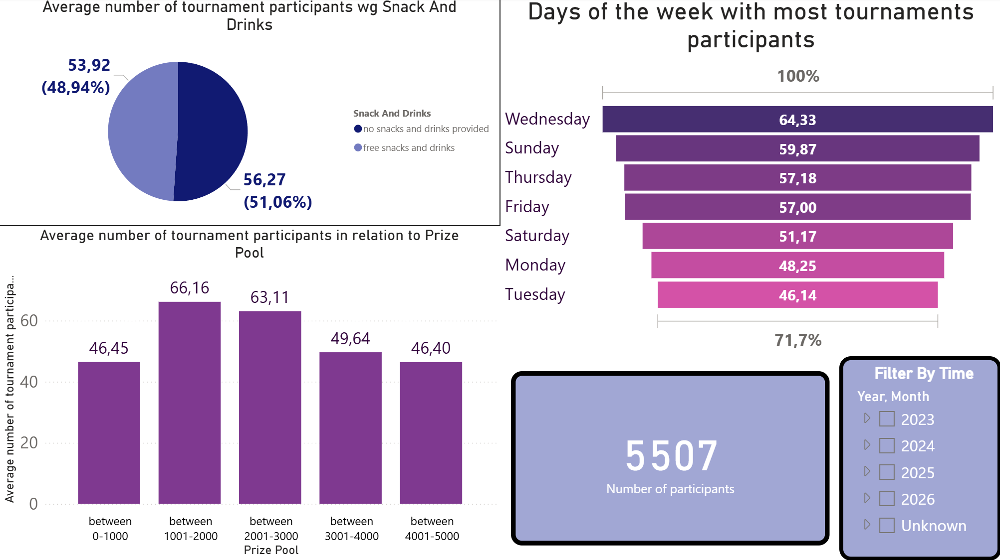
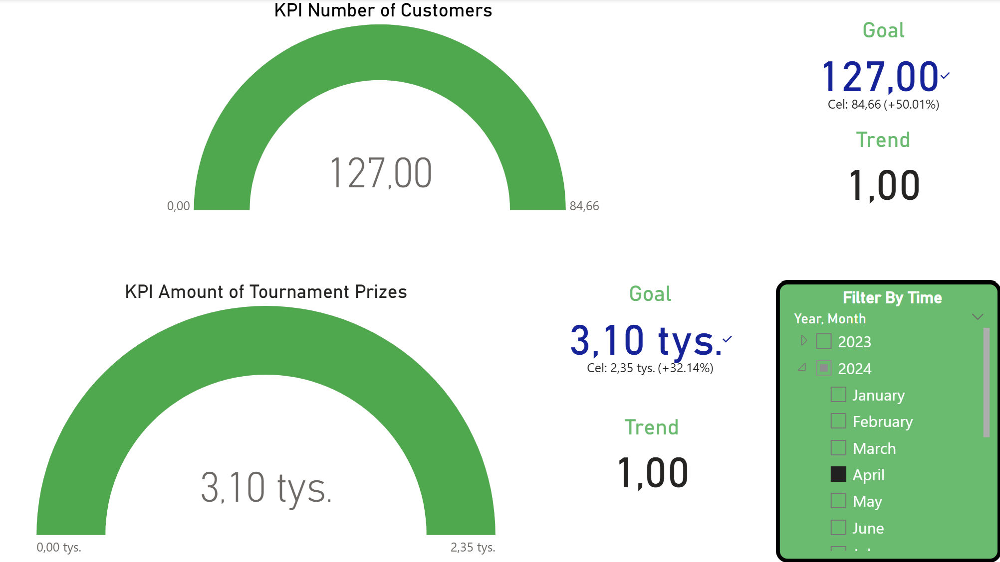
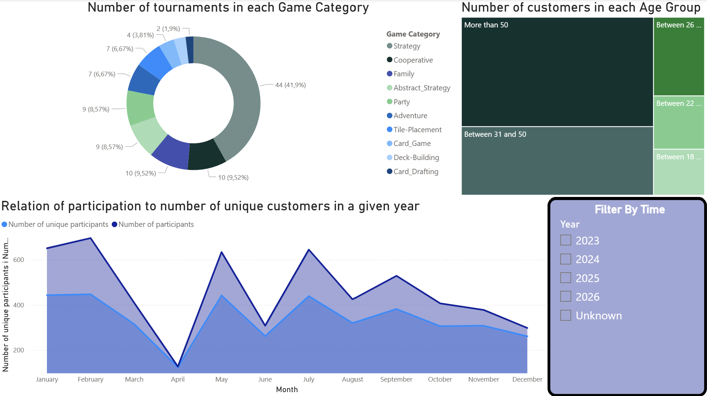

# Data_Warehouse_Personal_Project_BoardGamesShop
## Repo description
The "organization" that is analyzed is a board games shop which organizes tournaments for it's clients.
All the data is fictional and generated by a python script in the repo.
Warehouse is used for analytical queries that allows us to see things like: tournaments performance, clients behaviour, ...
This project fully covers everything from:
- Creating a transactional database, generating it's data with a python script generator
- Creating data warehouse and using T-SQL queries for ETL
- Analytical queries, PowerBi dashboards
## Tech stack
- **SQL Server** – transactional database & data warehouse
- **ETL (T-SQL files written in SQL Server that are run by Visual Studio project)** – data transformation and loading
- **MDX/SQL** – analytical queries & KPIs
- **Power BI** – data visualization and dashboards
- **Bulk file generator** – automated data population for the transactional DB
## ERD

## KPIs and Analytical Queries
KPIs:
1. 2% month-over-month increase in the number of customers taking part in our tournaments compared to the previous month.
2. 2% month-over-month growth in winning prize at our location
Examples of business questions solved with the warehouse:
- What is the impact of prize pool on the number of participants?  
- Which board games attract the most players?  
- Are tournaments on weekends more popular?  
- Does the time of day (morning/evening) influence attendance?
## PowerBI dashboards

